# 为什么最终选择Obsidian
主要基于以下核心优势
1.数据安全与本地优先
- 所有笔记以Markdown格式存储在本地，数据完全自主可控
- 可通过GitHub实现安全的云端同步


2.极致性能与稳定性
- 界面流畅无卡顿，支持完全离线使用
- 自动保存，内容零丢失


3.强大的扩展能力
- 丰富的插件生态，可自由定制功能
- 完美支持AI工具集成

4.专业的Markdown支持
- 双向链接构建知识图谱，笔记间智能关联
- 完整支持技术文档所需的各类元素

# 1.安装&配置
## 1.下载
打开官网,[https://obsidian.md/](https://obsidian.md/),根据自己的系统下载对应的版本
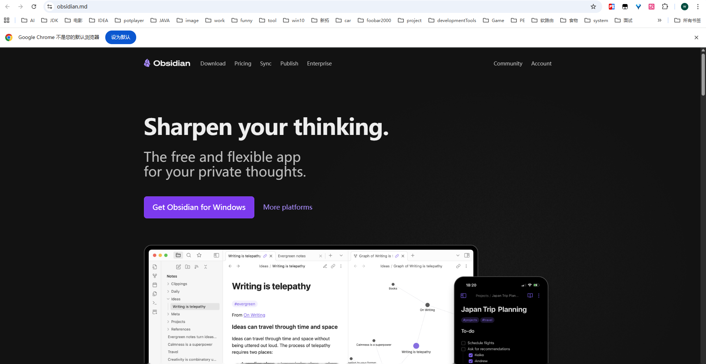
一路点下一步即可,可以自选安装目录
## 2.安装插件
### 1.git
	我们可以通过git实现远程备份,不同端远程访问
#### 1.前期准备

1.在GitHub上面创建一个库(repository),这个库就是用来保存你的笔记
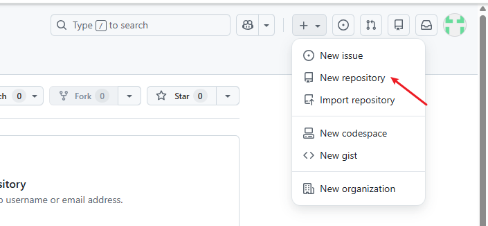
2.你本地（你电脑）存放笔记的文件夹，把库克隆下来
```
git clone 你的库地址
```

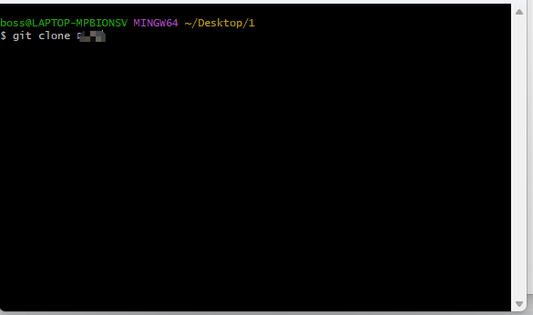
3.接下来添加一个 `.gitgnore`文件，在里面输入以下内容，防止将一些不想上传的也放进去了
```
.obsidian/workspace.json 
.obsidian/workspace-mobile.json
```

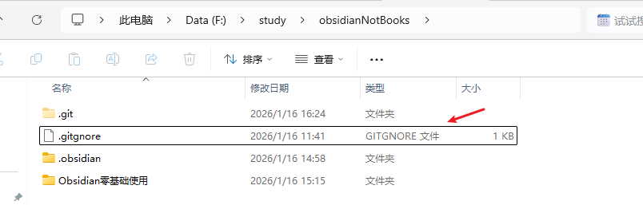
4.在"打开本地仓库"选择我们刚刚clone下来的文件夹

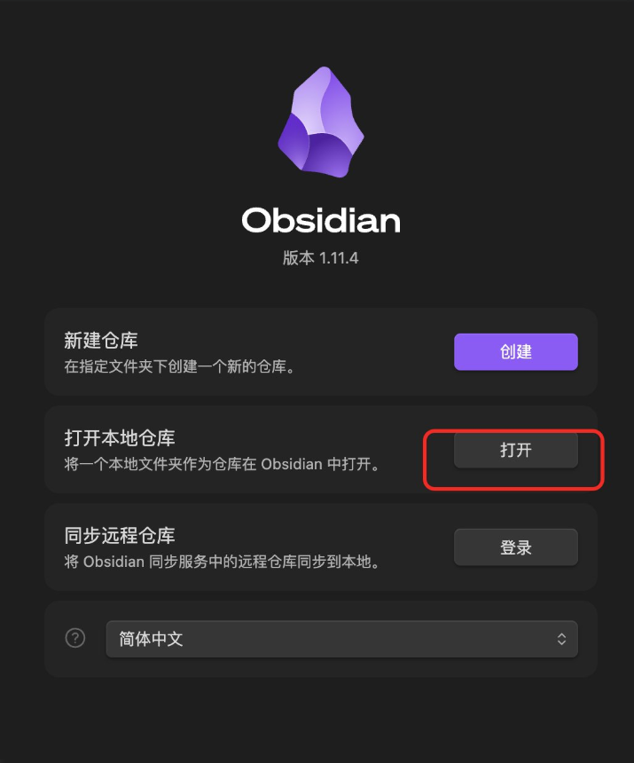
#### 2.安装插件

我们点击第三方插件，然后先将安全模型关闭，然后点击浏览，在搜索框输入git，下载第一个


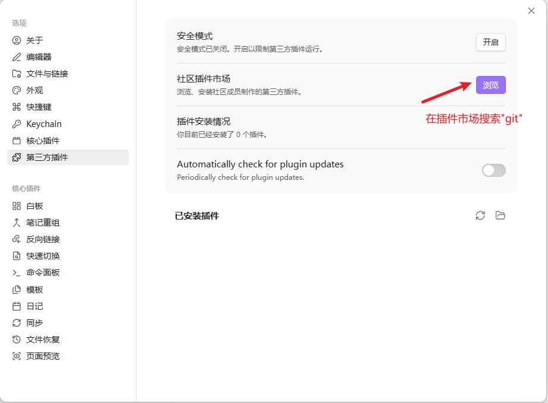

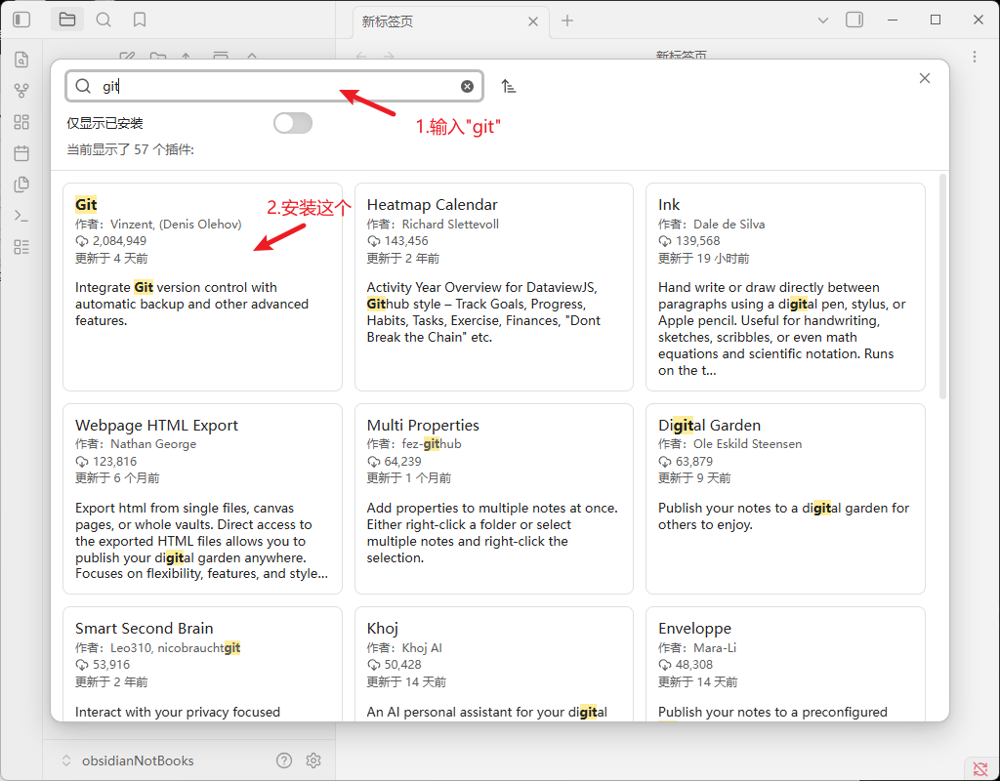

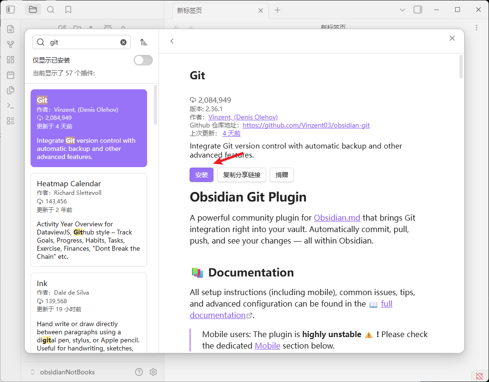

#### 3.配置插件

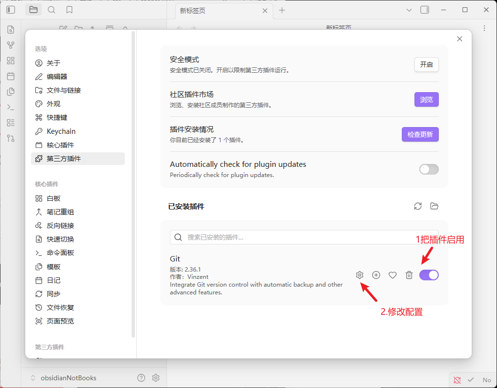

在选项这里
1.在启动软件时,把笔记推上(pull)远程仓库
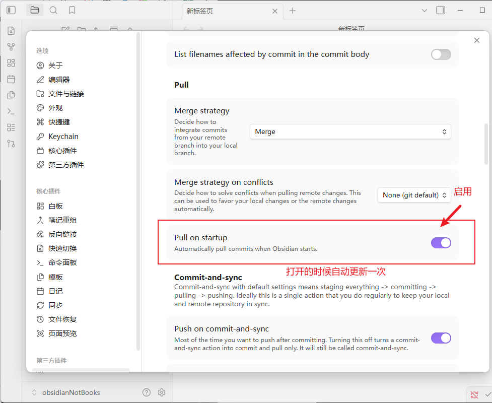
这样我们进行修改以后，再右边就会有黑框，告诉你 pull

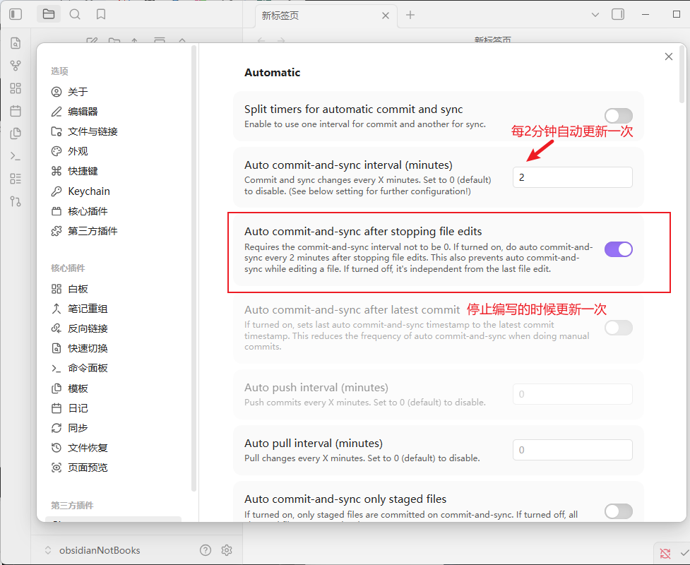

### 2.图片插件
#### 1.安装
我们在写文档的时候必定会使用很多图片，默认的图片，不是按照md语法渲染的，不好用，然后图片放置也很随意，我们需要安装下面这个插件,插件市场搜索 Custom attachment 安装然后启动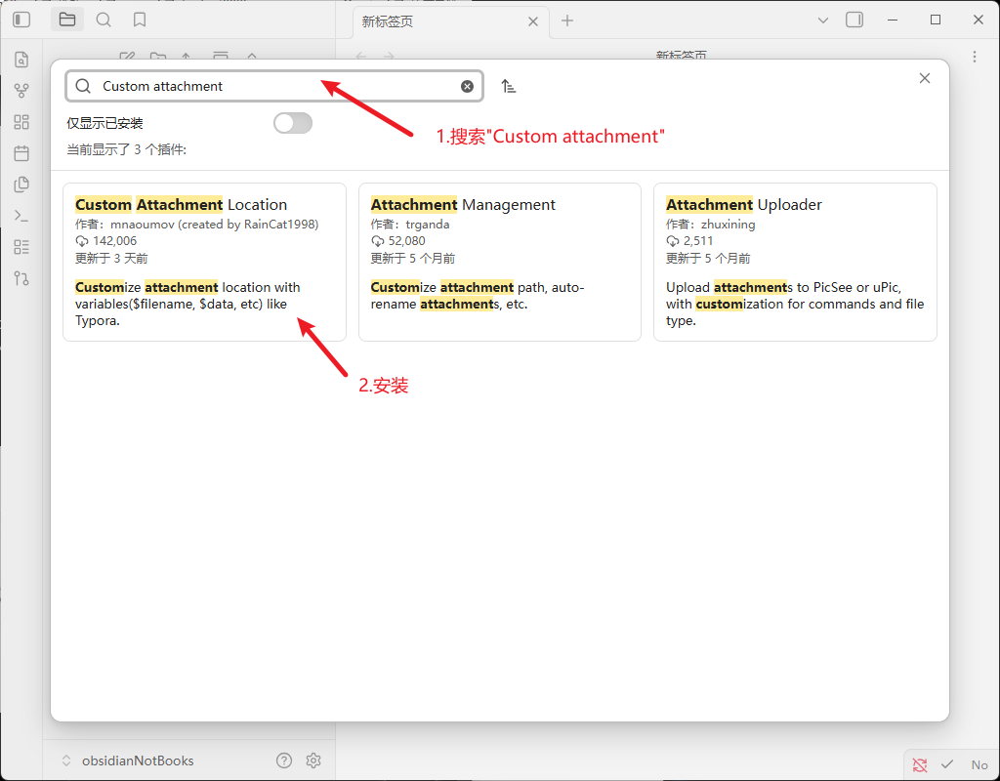

#### 2.配置


点击选项需要配置一下几个东西
1. Markdown URL 格式
```
assets/${noteFileName}/${generatedAttachmentFileName}
```
2. 还有按照我图片的配置都选一下，要和我保持一致

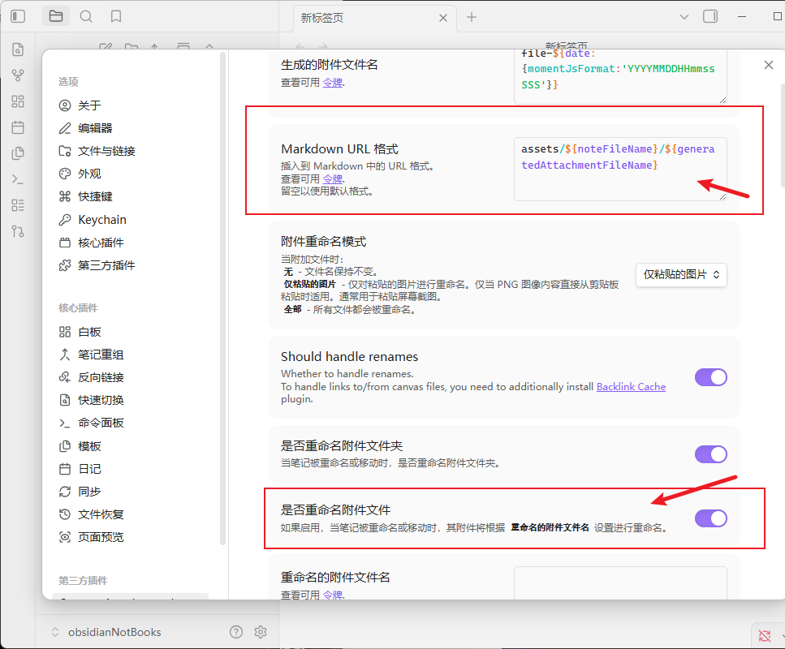
3. 点击文件与链接也需要改下面两个
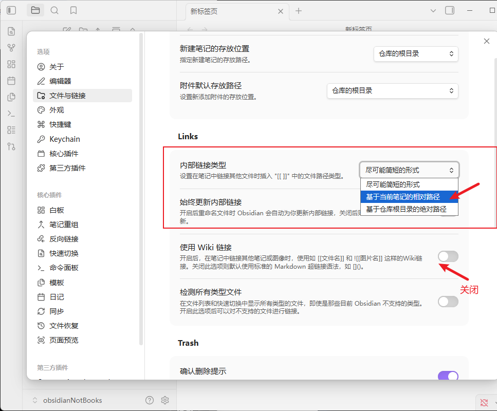
#### 4.效果
我们把本地图片拖拽进Obsidian来，可以看到图片的路径，同时可以在[]内的填入数字改变图片尺寸
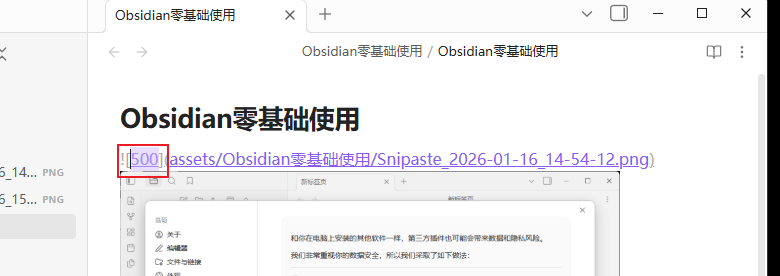
# 题外
## 1.Markdown语法基础

Markdown是一种轻量级标记语言，在Obsidian中用于排版笔记内容。以下是常用的Markdown语法
### 1.标题分级
使用`#`符号创建不同级别的标题，`#`的数量决定标题级别：
```
# 一级标题 
## 二级标题 
### 三级标题 
#### 四级标题
```
### 2.文本格式化
#### 1.加粗文本
使用两个星号包裹文字,如下
**这是加粗文字**

#### 2.斜体文本
使用一个星号包裹文字
*这是斜体文字*

#### 3.高亮文本
使用两个等号包裹文字
==这是高亮文字==
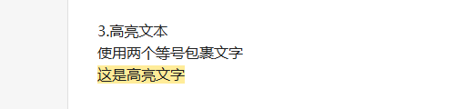

#### 4.删除线
使用两个波浪号包裹文字
~~这是删除文字~~
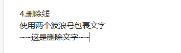

### 3.列表与任务管理
#### 1.无序列表
使用`-`或`*`开头 与文字有空格,父子项根据横杠的空格数
```
- 列表项1
- 列表项1
 - 子列表项1
```
- 列表项1
- 列表项1
 - 子列表项1
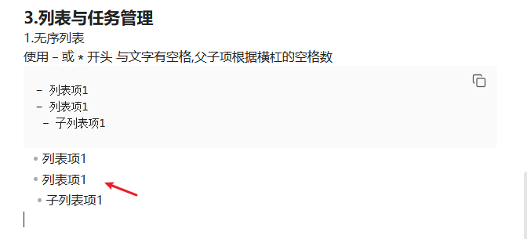
#### 2.有序列表
使用数字.开头
1. 第一项
2. 第二项
3. 第三项

#### 3.任务列表
使用`- [ ]`创建待办事项 [ ]里面输入代表以完成
```
- [x] 已完成的任务 
- [ ] 未完成的任务
- [ ] 待处理的任务
```
- [x] 已完成的任务 
- [ ] 未完成的任务 
- [ ] 待处理的任务

#### 4.代码块
行内代码：使用反引号包裹
这是`代码示例`的效果
代码块：使用三个反引号包裹，可指定语言实现语法高亮
```
def hello_world(): 
	print("Hello, World!")
```

#### 5. 表格
鼠标"右键"-->插入表格
格子扩建,把鼠标放在你要扩的方向边上,出现加号
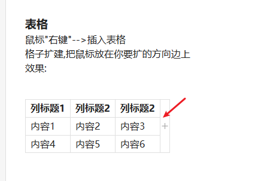
效果:

| 列标题1 | 列标题2 | 列标题2 |
| ---- | ---- | ---- |
| 内容1  | 内容2  | 内容3  |
| 内容4  | 内容5  | 内容6  |
